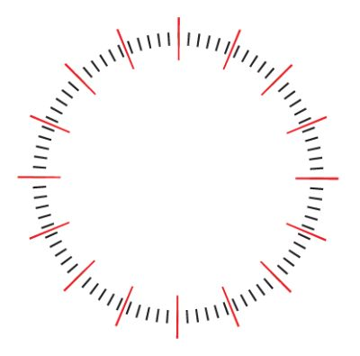
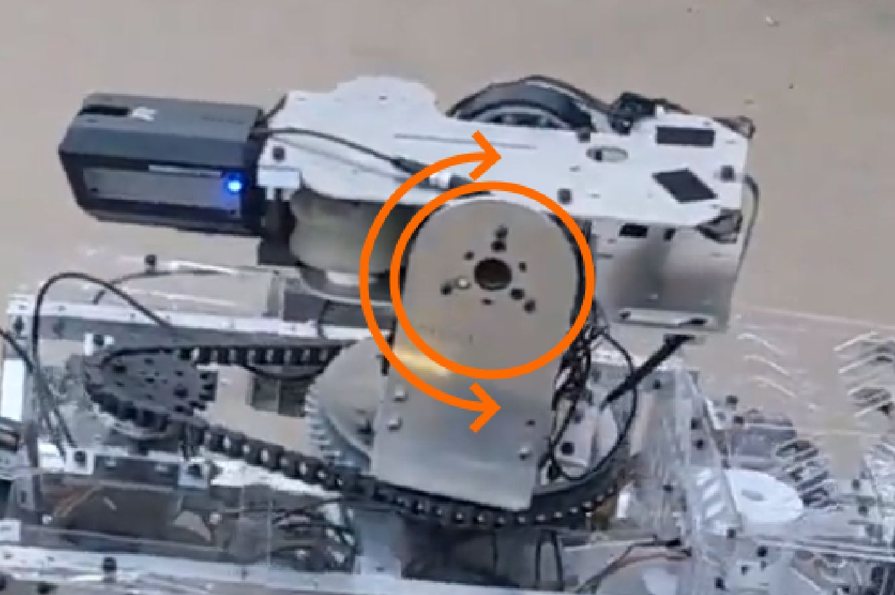
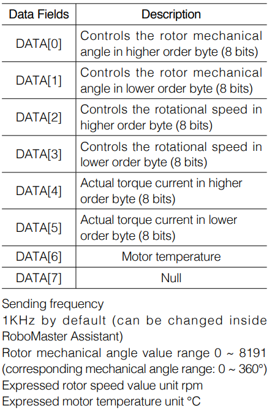
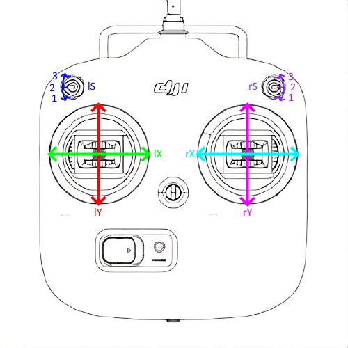

# Motors

There are about three types of DJI Motors we use:

They are programmed slightly differently, which is why it’s necessary for the code to
know which motor on which port is which type.

| GM6020                 | M3508                                     | M2006                                     |
| ---------------------- | ----------------------------------------- | ----------------------------------------- |
|  |  |  |

## Constructor

```C++
DJIMotor(short motorID, CANHandler::CANBus canBus, motorType type = STANDARD, const std::string& name = "NO_NAME");
```

In this constructor, the motorID is the physical ID of the motor. There can be up to 8 motors attached to one CAN bus, so the ID is a number from 1 to 8.

The DJIMotor class supports assigning motors to either bus, so we can have a motor on `CANBUS_1` or `CANBUS_2`. For this, we use enums.

The motor type is also an input in the constructor, as the DJIMotor treats motors differently depending on what type of motor they are. The important enum names to know are `M3508`, `M2006`, and `GM6020`.

#### Motor IDs

One thing to note with motor IDs is that there is an unusual style of overlap between the M3508, M2006, and GM6020 IDs. M2006s and M3508s act the same, but GM6020's act as M3508s shifted forwards by 4.

| True ID | 1   | 2   | 3   | 4   | 5   | 6   | 7   | 8   | 9   | 10  | 11  | 12  |
| ------- | --- | --- | --- | --- | --- | --- | --- | --- | --- | --- | --- | --- |
| M3508   | 1   | 2   | 3   | 4   | 5   | 6   | 7   | 8   | DNE | DNE | DNE | DNE |
| M2006   | 1   | 2   | 3   | 4   | 5   | 6   | 7   | 8   | DNE | DNE | DNE | DNE |
| GM6020  | DNE | DNE | DNE | DNE | 1   | 2   | 3   | 4   | 5   | 6   | 7   | DNE |

For example, you could have an M3508 on ID 2, an M2006 on ID 7, but then the M2006 on ID 7 would prevent you from having a GM6020 on ID 3. In the underlying structure, we would assign them data the same and they give us feedback the same. This is something you need to consider when you wire robots and set their IDs. One final thing to keep in mind is that the GM6020's range from 1-7, so the total theoretical max motors per bus is 11, not 12

#### Setting IDs for Motors

When you set the ID for a M3508 or M2006, you push the button on the ESC once, then tap it the number of the id you want to set it as, and then after a second it will set the ID.
<insert video>
For example, if we were to set one to ID 3, we would go
TAP--TAP-TAP-TAP-------
and that would set it to ID 3.

For the GM6020s, there are 4 binary switches, three of which you flip in a way to set it as a binary number. The three switches will give you a range from 0-7, where valid combinations are 1-7.

## Feedback

You can get four types of feedback from any of the CAN motors. We can assume we have a motor named `indexer`.

`indexer.getData(ANGLE)` Returns the angle of the motor, in ticks.

`indexer.getData(VELOCITY)` Returns the velocity of the motor in RPM.

`indexer.getData(TORQUE)` Returns the torque current of the motor.

`indexer.getData(TEMPERATURE)` Returns the temperature of the motor in Celsius.

Our CANMotor class actually adds two more types of data that are not built into the motor, but that we’ve built into the class for ease of use.

`indexer.getData(MULTITURNANGLE)` Returns the total angle of the motor, in ticks. If we use ANGLE, it only returns a value from 0 - 8191, and rolls over when it reaches either bound, but `MULTITURNANGLE` returns the angle without rollover.

`indexer.getData(POWEROUT)` Returns the power being sent to the motor, regardless of what movement mode the motor is in.

## A note on ticks

One rotation contains 8192 ticks. You have access to this number from the DJIMotor class `TICKS_REVOLUTION`

Ticks are the main method of measuring angle and position, however they behave differently on M3508s and M2006s than on GM6020s. On a GM6020, it behaves as you would expect, where each rotation of the output shaft is equivalent to 8192 ticks.

However, on an M3508 or an M2006, 8192 ticks is equal to one rotation of the internal motor, and that goes through a gearbox, which is 1:19 for a M3508 and 1:36 for an M2006. This means that 8192 ticks is actually 1/19 of a rotation or 1/36 of a rotation, respectively.



## Making it Move

#### setPower()

Making a motor move can be done one of three ways. These all work on all three types of motors. We can assume we have a motor named `indexer`.

`indexer.setPower(int power)` gives the motor a raw current to run with with a range of -20A to 20A. The motor is not responding to any stimulus regarding its own speed, position, or torque, it just runs.
The domain of input is -16384 to 16384, for the `M3508` and `M2006` and -32767 to 32767 for the `GM6020`. You can find these values in the DJIMotor class as `INT15_T_MAX` and `INT16_T_MAX` respectively.

For an M3508, the current you give directly corresponds to a torque, which means that giving the motor a power just determined the acceleration it takes to get to the top speed.

For a GM6020, the current seems to correspond to a speed, but with a load this changes.

#### setSpeed()

The second way is to give it a speed. We can assume again we have a motor named `indexer`.

`indexer.setSpeed(int speed)` has the motor run at a speed. This runs the output through a PID, and the CANMotor class is using the motor’s encoder values to regulate it’s speed. This is in RPM.

For this specific case, the desired would be whatever speed you set, which remains as the desired speed value until another value is set. The actual value of the PID is the velocity matter we get from the motor, which is in RPM.

For setSpeed to work correctly, the motor’s speed PID needs to be tuned specifically, as the same PID will change based on the load of the motor. A motor on the wheel is going to behave differently than the motor controlling the pitch of the turret.

#### setPosition()

Our final option is to give the motor a position. Again the motor is named `indexer`.

`indexer.setPosition(int position)` has the motor run to and stay at a specific position. This runs through a separate PID, and in this movement mode, the CANMotor class is also regulating using the motor’s encoder values. The position is in ticks, where 8192 ticks is in one rotation.

The PID for the motor also needs to be tuned per-motor for setPosition to work correctly.



## s_sendValues()

`s_sendValues()` sends the messages on the CAN line based on what the DJIMotor class has determined to be the powerOut values. If we are power controlling a motor, we directly control the value it sends, and if we are using a Speed or Position PID, we declare an RPM or an angle and it goes through the respective PIDs to send a value instead.
The `s_sendValues()` function goes through both busses and sends values for all motors. A motor that does not exist will just be sent two bytes of zeroes.

When you do `setPosition()` or `setSpeed()`, it evaluates the target position or speed, and each time `s_sendValues()` is run, it runs the desired values through the PID to result in the power that would get the motor to that desired speed or position. Those are then sent to the motors. It’s important to run `s_sendValues()` every time you want to send new information to the motors. However, running it too often will cause the feedback data to get corrupted, so we only run `s_sendValues()` once every 10ms, same as most other code that can be run at a less urgent speed.

## s_getFeedback()

`s_getFeedback()` gets data from motors. We get four elements of data, stored in 8 bytes, and with an address so we know which motor sent it.

The data comes in a similar way to the way we send it, with two bytes corresponding to each element of data. The exception here is temperature, which only uses one byte, and the last byte is permanently null.



When we get the data in `s_getFeedback()`, we store it in the DJIMotor object. Each DJIMotor has variables for the data we get, like Velocity, Angle, Temperature, and Torque. `s_getFeedback()` is simply the all-encompassing function that reads the CAN signals coming in, so it's important to run it often. We call `s_getFeedback()` as fast as the code can run

## CANHandler

The CANHandler is what handles all the underlying low level communications between the motor and our controller. The CANHandler handles the recieving and sending of the 8-byte messages sent to and from the DJI Motors.

In this separate document, we go more into depth on the CANHandler and our protocol: [DJIMotor Protocol In Depth](DJIMotorProtocolInDepth.md)

## Remote Bits

There are a number of remote functions and variables that we use to interface with the remote. For this sim, we have imitation functions that will mimic a behavior of a remote flipping on and off.

`remoteRead()` is something that needs to be called at the start of every loop. It actually grabs the UART data from the remote and sets the remote values. The remote we use has 4 axis values and 2 tri-state switches. These correspond with 6 built in variables for you to use. 



The four axes are `lX`, `lY`,`rX`, `rY`, and they have bounds of -660 to 660.
The two switches are `lS` and `rS`, and they have one of three states, `Remote::SwitchState::UP`, `Remote::SwitchState::MID`, or `Remote::SwitchState::DOWN`.

# Exercise #1

For this exercise, we're writing main robot code. The task is to make the main robot code do as such: 

We have three robot modes we want you to code, depending on the left switch `lS`. If it is up, we are in power mode, if it is mid we are in speed mode and if is down we are in position mode.

For all three modes, set the respective element to 10x the left stick x  `lS` value.

You can use getData to see what the value is, given a specific `motorDataType`.

There is again [starter code](motorMove.cpp). This time, you have full freedom to change anything in the main class section, but nothing above, as thats all part of the base classes. We do recommend adding prints anywhere, to help you debug your code, but make sure your code works with the original classes.

You don't need to worry about adding any referee or inner-outer loop stuff, like in the example code, but all motor/remote related components you will need.

# Final Thoughts

As you finish the training program, we've compiled a small overview of the classes we use and how they fit together, and you can find that [here](classesOverview.md). It is intended to make the transition to working on the robot easier.
